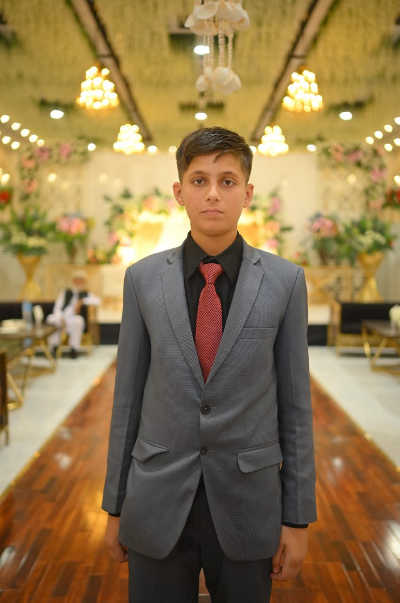
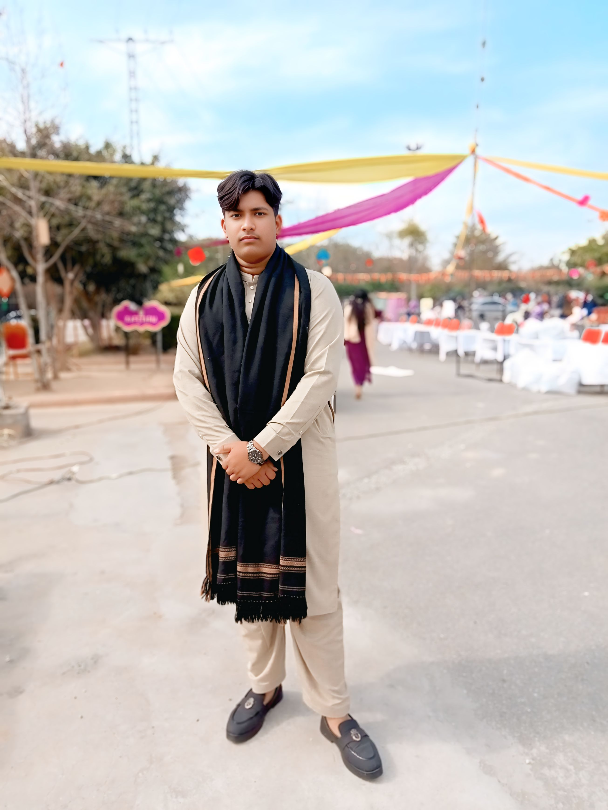

<!DOCTYPE html>
<html lang="en">
<head>
    <meta charset="UTF-8">
    <meta name="viewport" content="width=device-width, initial-scale=1.0">
    <title>NK Esports | Nova Knightz PUBG Mobile</title>
    
    <link rel="stylesheet" href="https://cdnjs.cloudflare.com/ajax/libs/animate.css/4.1.1/animate.min.css"/>
    <link href="https://fonts.googleapis.com/css2?family=Orbitron:wght@400;700&family=Rajdhani:wght@500;700&display=swap" rel="stylesheet">
    
    
</head>
<body>

    <nav class="flex justify-between items-center px-10 py-6 absolute w-full z-50">
        

            NK ESPORTS
        

        <ul class="hidden md:flex space-x-8 font-gaming text-sm tracking-widest">
            <li class="hover:text-yellow-500 cursor-pointer transition">HOME</li>
            <li class="hover:text-yellow-500 cursor-pointer transition">ROSTER</li>
            <li class="hover:text-yellow-500 cursor-pointer transition">TOURNAMENTS</li>
            <li class="hover:text-yellow-500 cursor-pointer transition">MERCH</li>
        </ul>
        <button class="bg-yellow-600 hover:bg-yellow-500 text-black px-6 py-2 font-bold rounded-sm skew-x-[-15deg] transition duration-300">
            JOIN CLAN
        </button>
    </nav>

    <section class="h-screen flex items-center justify-center hero-gradient relative">
        

            <h2 class="text-xl tracking-[0.5em] text-yellow-500 animate__animated animate__fadeInDown">WE ARE THE NIGHT</h2>
            <h1 class="text-7xl md:text-9xl font-gaming font-bold gold-glow animate__animated animate__zoomIn">
                NOVA KNIGHTZ
            </h1>
            

                Dominating the Battlegrounds with precision, strategy, and power. 
                The elite PUBG Mobile squad for the next generation.
            

            

                <button class="border-2 border-yellow-500 px-8 py-3 font-bold hover:bg-yellow-500 hover:text-black transition duration-500">
                    WATCH LIVE
                </button>
            

        

    </section>

    <section class="py-20 bg-black">
        

            

                <h3 class="text-5xl font-gaming text-yellow-500 mb-2">150+</h3>
                
Chicken Dinners

            

            

                <h3 class="text-5xl font-gaming text-yellow-500 mb-2">12</h3>
                
Major Trophies

            

            

                <h3 class="text-5xl font-gaming text-yellow-500 mb-2">2M+</h3>
                
Fans Worldwide

            

        

    </section>

    <section class="py-20 px-10">
        <h2 class="text-4xl font-gaming font-bold mb-16 text-center underline decoration-yellow-500 underline-offset-8">THE ELITE SQUAD</h2>
        

            

                
                

                    
IGL

                    <h4 class="text-2xl font-gaming">NK Asim</h4>
                

            

            

                
                

                    
SNIPER

                    <h4 class="text-2xl font-gaming">NK Mohsin</h4>
                

            

            

                
                

                    
ASSAULTER

                    <h4 class="text-2xl font-gaming">NK Basit</h4>
                

            

            

                
                

                    
SUPPORT

                    <h4 class="text-2xl font-gaming">NK Arham</h4>
                

            

        

    </section>

    <footer class="py-10 border-t border-gray-900 text-center">
        
&copy; 2024 NK ESPORTS (NOVA KNIGHTZ). ALL RIGHTS RESERVED.

    </footer>

</body>
</html>
